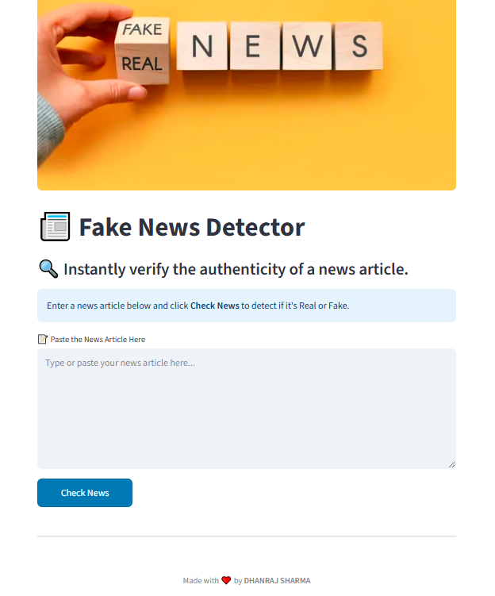
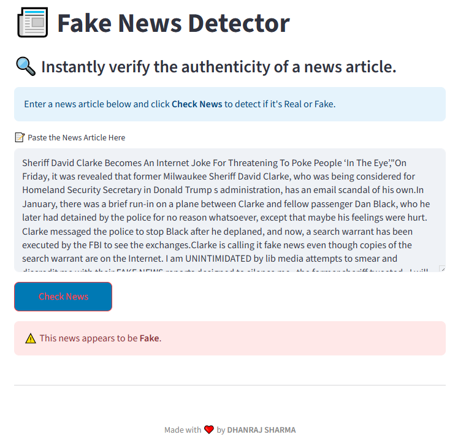
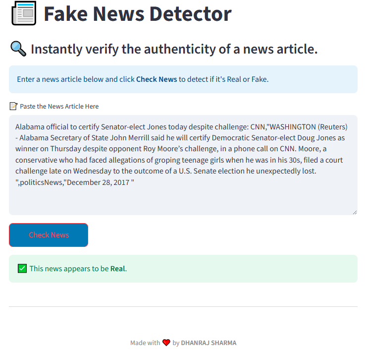
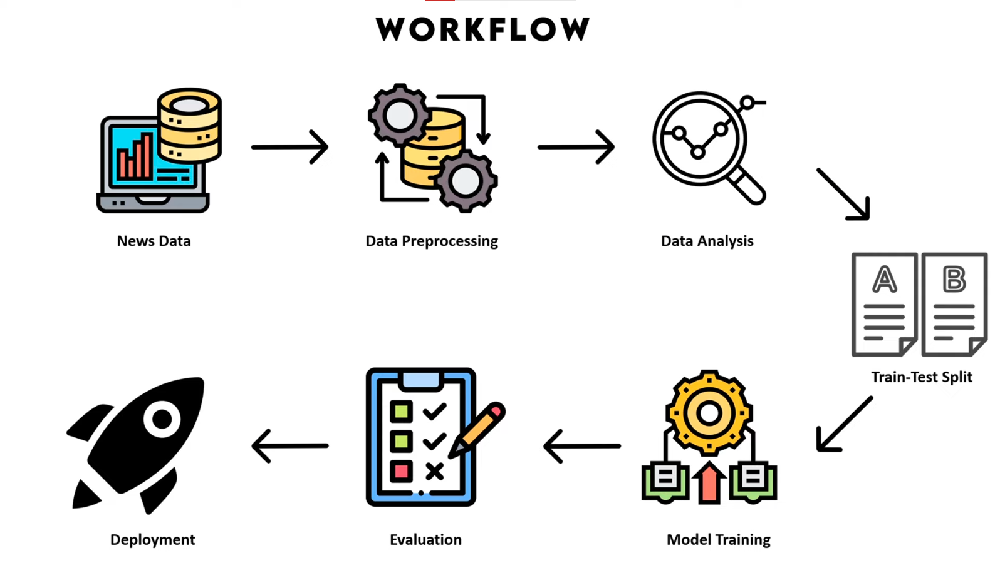

# 📰 Fake News Detector

### **NOTE !!!**
This app simply works on the training data I have used. It can not classify lates or live news ; to do that you can use web scraping and train on that data.!!!


> ***Unmask the truth, one article at a time.***
> https://fake-news-detector-using-ml-nddimension.streamlit.app/

In an age of viral misinformation, the **Fake News Detector** empowers you to **verify news content with AI**. Whether you're a journalist, researcher, or just a concerned reader — our model helps you **distinguish** between **what's real and what's fake** using machine learning.


## Image Preview 🌟



## Fake News 



## Real News



## 🚀 Why Fake News Detector?

 "*Misinformation can spread faster than truth.*"
Fake News Detector uses NLP and logistic regression to analyze textual content and give a verdict in seconds.

> 🌠 Paste an article.
>  ▲ Click a button.
> ✔️ Know the truth.

No browser plugins. No heavy tools. Just instant AI validation.

## 🌟 Workflow




## 🧠 How It Works

1. **Preprocessing**: Cleans and normalizes raw text using regex.


2. **Feature Extraction:** Converts text into numeric vectors with ***TF-IDF***.

3. **Model Prediction:** A trained ***Logistic Regression*** model evaluates the text.

4. **Verdict:** The model outputs `Real` or `Fake`, based on learned patterns.

⚡ All under the hood with lightning-fast performance.


## 🧰 Features

| Function            | Description                                  |
| ------------------- | -------------------------------------------- |
| 🔍 Paste & Analyze  | Paste full news articles directly in the app |
| ✅ Real-time Results | Instantly receive prediction feedback        |
| 💾 Model Saving     | Uses `joblib` to store trained models        |
| 📊 Metrics Output   | View precision, recall, and F1-score         |
| 🌐 Streamlit UI     | Intuitive and elegant web interface          |


## 📦 Requirements

```txt
pandas
scikit-learn
joblib
streamlit
Pillow
```

Install everything using:
```bash
pip install -r requirements.txt
```


## ⚙️ Getting Started

1. **Clone the repository**
```bash
git clone https://github.com/NDDimension/Fake-News-Detector-using-ML.git
cd fake-news-detector/CODE FILE
```

2. **Download Dataset**
```txt
https://drive.google.com/drive/folders/1uViefNaUP9xhgzR5O4xrAOWYJpuYBOjt
```   

3. **Execute**
```
app.ipynb
```

4. **Run the Fake News Detector**
```bash
streamlit run frontend.py
```

5. **Paste an article and get your result!**


## ✨ Highlights

- ✅ Minimal setup — just paste and analyze

- ✅ Lightweight and fast ML pipeline

- ✅ Custom CSS and styled UI with Streamlit

- ✅ Easy to retrain with new data


## 🔮 What’s Coming

- 📌 Browser extension integration

- 🧠 Model upgrade to transformer-based classifiers (like BERT)
 
- 📱 Mobile-ready PWA version

- 🌍 Multi-language support


### 🧠 Powered by:

- scikit-learn
- Streamlit
- pandas
- joblib


## 📜 License

Licensed under the [MIT License](LICENSE).


> **Fake News Detector** — Let AI be your truth filter.
